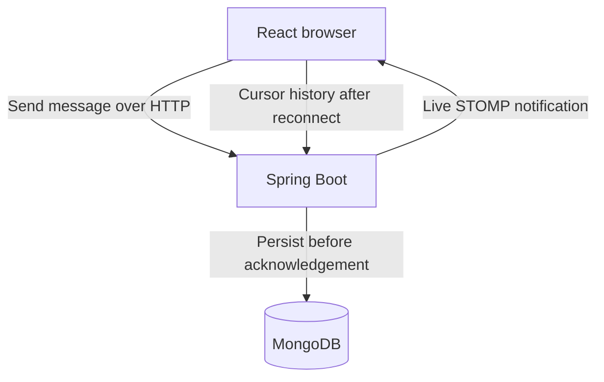

# Chat App

A guest-room chat application built with Java 21, Spring Boot, MongoDB, React and STOMP.

The backend persists messages before acknowledging sends. WebSocket notifications provide live updates; cursor-based history recovers missed updates. This version runs one backend instance and is intended for local demonstration, not private conversations on the public internet.

## Choose a setup

| Setup | Requirements | Start command (repository root) |
| --- | --- | --- |
| Everything in Docker | Docker Desktop, Linux containers | `docker compose up --build` |
| App containers + existing database | Docker Desktop and a reachable MongoDB URI | `docker compose -f compose.external-db.yml up --build` |
| No containers | Java 21, Node.js 22, MongoDB 8 | Start backend and frontend separately as shown below |

For a new checkout:

```sh
git clone https://github.com/Abhay123abhi/chat-app.git
cd chat-app
```

To try these changes before they are merged, run `git switch --track origin/improvement/reliable-chat-foundation` in the fresh checkout. After merge, the setup is available on `main`.

## How messages flow



HTTP confirms storage; WebSocket notifications update connected browsers. History recovery and message IDs reconcile missed or repeated notifications. The in-process broker and per-room write locks currently require one backend instance. See [architecture and scaling](docs/architecture.md) for failure boundaries and the multi-instance plan.

## Run with Docker

Requires Docker Desktop with Compose.

```sh
docker compose up --build
```

Open http://localhost:3000 in two browser windows, choose different display names, and join the same room. Room IDs accept letters, digits, underscores and hyphens.

MongoDB is persisted in the existing `mongo-data` volume. `docker compose down` preserves it; do not add `-v` unless you intentionally want to delete the database.

## Smaller local footprint

The backend runtime uses Java 21 JRE on Alpine. The frontend already uses nginx on Alpine; Node and Maven only run in build stages. Build images and caches still occupy disk on the machine that builds them.

Default runtime memory limits are 64 MiB for nginx, 512 MiB for Java, and 768 MiB for MongoDB (1,344 MiB combined, excluding Docker Desktop and builds). Java's heap can use up to half its limit, leaving room for native memory; MongoDB's WiredTiger cache is set to 256 MiB. These are small-demo budgets, not measured minimum requirements. Raise FRONTEND_MEMORY_LIMIT, BACKEND_MEMORY_LIMIT or MONGO_MEMORY_LIMIT for larger workloads.

The official MongoDB 8 image is retained for existing data compatibility. Its image size on disk is different from runtime RAM usage. We do not strip database binaries or switch to an older database just to shrink the image.

To avoid downloading or running a MongoDB container, use an existing MongoDB instance with the standalone external-database configuration. For MongoDB already running on Windows, run in PowerShell:

```powershell
$env:SPRING_DATA_MONGODB_URI="mongodb://host.docker.internal:27017/chatapp?w=majority&journal=true"
docker compose -f compose.external-db.yml up --build
```

The database must be reachable from Docker. You can also supply a hosted MongoDB connection URI; keep credentials out of git. This mode runs only the frontend and backend. It does not move data from an existing Docker volume; use the URI for the database you intend to use and migrate old history there first.

To switch from the full stack, first run `docker compose down` (without `-v`). Stop external mode using `docker compose -f compose.external-db.yml down`. Use `docker stats` for runtime memory and `docker system df` for disk/cache usage. To inspect final image sizes, run `docker compose images`. No image-size reduction percentage is claimed without a build measurement.

## Existing installations: migrate first

The old version stored all messages inside each room document. The new version refuses to start when non-empty embedded history is present, rather than silently hiding it.

1. Stop the old backend and make a MongoDB backup with `mongodump`. Keep the backup until you have verified room/message counts and timestamps.
2. Start only the database: `docker compose up -d mongo`.
3. From the repository root, copy and run the migration:

```sh
docker compose cp scripts/migrate-history.js mongo:/tmp/migrate-history.js
docker compose exec mongo mongosh "mongodb://localhost:27017/chat-app" --file /tmp/migrate-history.js
```

4. Start the new application with `docker compose up --build`.

If the old database is named `chatapp`, use that database name in the migration and in `SPRING_DATA_MONGODB_URI`. Never run the migration against a different database and assume the existing data moved.

The script uses deterministic legacy request IDs so interrupted runs can resume. It removes a room's embedded array only after its inserts complete. Duplicate room IDs, invalid room IDs or invalid timestamps require manual reconciliation; the script stops rather than guessing. Old BSON date values retain their instant; the old application used local timestamps, so timezone assumptions should be checked against the backup. The original old build cannot read migrated history; restore the backup before rolling back.

## Run without containers

Start MongoDB locally, then:

```sh
cd chat-app-backend
bash ./mvnw spring-boot:run
```

In another terminal:

```sh
cd chat-app-frontend
npm ci
npm run dev
```

On Windows PowerShell, run `./mvnw.cmd spring-boot:run` from `chat-app-backend`. Open the URL printed by Vite (normally http://localhost:5173). Vite proxies REST and SockJS to port 8080. The container uses nginx for the same-origin proxy. No frontend backend-URL edit is needed.

## Troubleshooting

- **Port already in use:** the full Docker stack binds 3000, 8080 and 27017 on localhost. Stop the conflicting service, change the host-side port in Compose, or use external-database mode if MongoDB is already installed.
- **Browser shows a gateway error during startup:** wait for Spring Boot to finish starting. Check `docker compose logs --tail=100 backend mongo` if it persists.
- **Backend requests a history migration:** follow the migration section against the same database used by the application.
- **Database connection fails in external mode:** `localhost` inside the backend container is not your Windows host. Use `host.docker.internal`, check the database listener/firewall, and verify the URI's database name.
- **Container exits with code 137:** check Docker Desktop's available memory and container logs. Increase the relevant memory limit for your workload; image disk size does not indicate RAM consumption.

## What works

- Create/join guest rooms with persistent history.
- Individual message documents with indexed room sequence and request identity.
- Retry a failed send using its original request ID.
- Explicit sending, sent and failed states. Sent means stored, not read or delivered to every participant.
- Reconnect/resubscribe, history reconciliation every five seconds, and ID-based merging.
- Older history loading with an exclusive cursor.
- New-message indicator while reading older history.
- Multiline composer, a single dark theme, and connection status. Native keyboard emoji input remains available.

Fake file-upload success and local-only pins were removed. Real attachments and shared pins should be implemented with server persistence rather than advertised as working.

## API

| Request | Result |
| --- | --- |
| POST /api/v1/rooms, text/plain room ID | Create room; duplicate ID returns 409 |
| GET /api/v1/rooms/{roomId} | Room metadata; missing room returns 404 |
| POST /api/v1/rooms/{roomId}/messages | Persist or return the original matching retry |
| GET /api/v1/rooms/{roomId}/messages?limit=50 | Latest page, displayed oldest to newest |
| GET .../messages?before=123&limit=50 | Older page |
| GET .../messages?after=123&limit=100 | Recovery page, ascending |

Send body:

```json
{"clientMessageId":"a-unique-request-id","sender":"Abhay","content":"Hello"}
```

Reuse the exact request ID, sender and content for a retry. Changing payload under the same key returns 409. The room in the URL is authoritative. Clients cannot publish directly to STOMP broker topics; WebSocket is receive-only.

History responds with `messages`, `hasMore` and `nextCursor`. Use `nextCursor` with the same direction until `hasMore` is false. Sequence gaps are allowed; do not wait for every integer.

## Tests

```sh
cd chat-app-backend
bash ./mvnw verify
```

The MongoDB Testcontainers test needs Docker and is skipped when Docker is absent. It exercises 100 concurrent unique sends, concurrent retries, persisted counts and recovery pagination. The ordinary unit tests do not need MongoDB.

```sh
cd chat-app-frontend
node --test src/services/messageState.test.js
npm run build
```

GitHub Actions runs Java 21 tests, frontend tests/build, both Compose configuration checks, and a container build/startup smoke test that creates a room and persists/reads a message through the frontend proxy. Browser reconnect behaviour and legacy-data migration still need the manual checks below. No load benchmark or production-scale guarantee is implied by the test sizes.

## Manual recovery checks

1. Join one room in two windows. Send simultaneously and check persisted history after rejoining.
2. Disconnect one browser, send from the other, then reconnect. The missing messages should be reconciled without duplicating messages already received.
3. Stop the backend and send. Restart it and choose Retry. The same client request ID is reused.
4. Send more than 50 messages, then load older history. No page should overlap at its exclusive cursor.
5. Read older history while another user sends. Use the New messages button to return to the bottom.
6. Leave while sends are pending; confirm the warning. Pending drafts are held in memory and do not survive refresh.

## Scope

Guest names are not verified identities. Anyone who knows a room ID can read/join it; there is no membership authorization, private-room claim or end-to-end encryption. Keep this demo on localhost until authentication, authorization and admission limits are implemented.

See [system design and scaling plan](docs/architecture.md) for delivery semantics, failure boundaries and the path to multiple instances.
