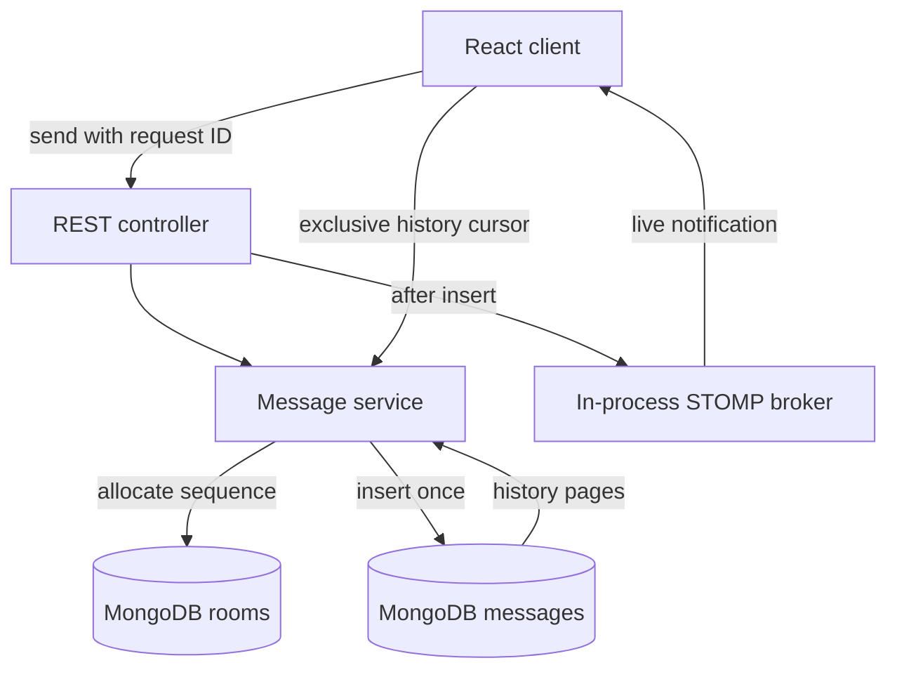

# Messaging design

## Current deployment

## Why REST for sends and STOMP for updates?

A successful HTTP response carries the stored message ID and sequence. It is an application acknowledgement, not merely evidence that a frame reached a broker. Both the HTTP response and WebSocket event may arrive at the client, so merging is by server message ID.

The room ID comes from the URL only. Request bodies cannot redirect storage into a different room. The WebSocket inbound interceptor rejects client SEND frames and wildcard subscriptions; otherwise a client could bypass persistence by publishing directly to /topic.

These checks do not implement private rooms. Authentication and room membership are deliberately separate follow-up work.

## Data and ordering

Rooms contain metadata and a sequence counter. Messages contain their own content, sender, UTC timestamp, room ID, request ID and sequence. Unique indexes protect room IDs, (roomId, sequence) and (roomId, clientMessageId). The history index supports exclusive range queries without loading the complete room.

A bounded array of 256 process-local locks serializes counter allocation and insertion for each room. Hash collisions can serialize unrelated rooms, but the lock collection does not grow with the number of rooms. Lock acquisition times out after five seconds. A busy room can return 429; retrying uses the original request identity.

This deployment requires one writer process. An atomic counter by itself does not guarantee commit order across several writers. Do not simply add backend replicas and assume these locks coordinate them.

Counter allocation and message insertion are separate MongoDB operations. A failed insert can leave a sequence gap. There is no exactly-once or contiguous-sequence promise. An acknowledged insert uses the configured database write concern; a timed-out insert may have an uncertain result. Retry with the same key to resolve that uncertainty. Rare delayed commits across uncertain failures can appear behind a previously read cursor; reloading history is the reconciliation path in this first version. Transactional sequencing is required to close that boundary.

## Delivery and recovery

Persist first, notify second. A process crash between those steps can lose the live notification, not the already stored history. Every five seconds the client reconciles forward history; reconnect also requests synchronization. Each recovery pass reads at most 20 pages of 100 messages and continues from the confirmed cursor on the next pass.

Only history responses advance that cursor. A later socket message must not move it past an earlier message not yet received. On first entry the latest 50 messages are loaded; older history remains explicitly paginated. Multiple copies of the same message are merged by ID and displayed by sequence.

The UI does not claim recipient delivery or read status. Failed sends keep the original payload in memory for retry. Refresh or leaving can lose unsent drafts. Long-lived browser sessions still accumulate messages in memory; add windowed rendering and an eviction strategy before very large conversations.

## Failure cases

| Failure | Behaviour / boundary |
| --- | --- |
| Duplicate create | Unique room index produces 409 |
| Same send retried | Original message returned if payload matches |
| Same request key, different payload | 409; original message preserved |
| Database unavailable | Send fails; user may retry with same ID |
| Counter advanced, insert fails | Gap allowed; no fabricated message |
| Insert succeeds, notification fails | Stored result acknowledged; history can recover |
| HTTP response lost after insert | Retry returns original record |
| Browser offline | Reconnect and recovery fetch |
| Late history response after live event | Merge rather than replace |
| Old embedded room history | Startup blocked until explicit migration |
| Guest knows room ID | Access permitted; private-room security is not implemented |

## Path to a multi-instance system

Implement these as measurable increments:

1. Establish server identity and enforce membership for REST reads/writes and STOMP SUBSCRIBE. Add request and connection admission controls before internet exposure.
2. Move sequence allocation, message insertion and notification intent into a MongoDB replica-set transaction. Use database uniqueness and transaction retry handling for competing requests, not process-local locks.
3. Publish notification intent from a transactional outbox or a recoverable change-stream consumer. Track publication progress, oldest pending age and retry attempts.
4. Replace the simple broker with an external STOMP broker relay for cross-node subscriptions. SockJS fallback may need load-balancer affinity. This solves fan-out, not database correctness.
5. Measure hot-room contention, send acknowledgement latency, recovery backlog and active connections. Add room partition ownership only when measurements justify it.
6. Keep typing/presence ephemeral and separate from durable message writes; define expiry and disconnect behaviour. Add read cursors with explicit semantics.

A broker consumer group that sends each event to just one arbitrary WebSocket node is insufficient: recipients may be connected to other nodes. Fan-out must match connection ownership or use a broker that routes to all relevant subscriptions.

## Validation and limits

The integration test checks concurrent inserts and retries against real MongoDB through Testcontainers. Frontend unit tests check history/live merging. Neither proves all network failure interleavings or production capacity. Browser reconnect, migration and container smoke checks are also required before merge.

The existing Java 21 / Spring Boot dependency baseline is retained so the reliability refactor is reviewable independently of a framework-major upgrade. Dependency upgrades should be tested in a separate PR; the current dependency set has not been certified free of vulnerabilities.

References:
- [Spring simple broker](https://docs.spring.io/spring-framework/reference/web/websocket/stomp/handle-simple-broker.html)
- [Spring external broker relay](https://docs.spring.io/spring-framework/reference/web/websocket/stomp/handle-broker-relay.html)
- [Spring WebSocket authorization](https://docs.spring.io/spring-security/reference/servlet/integrations/websocket.html)
